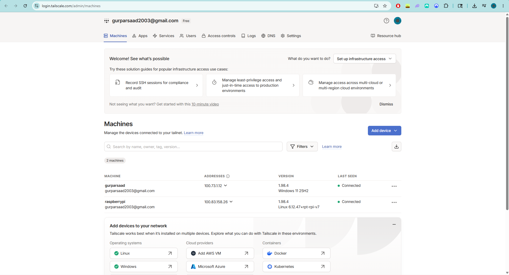
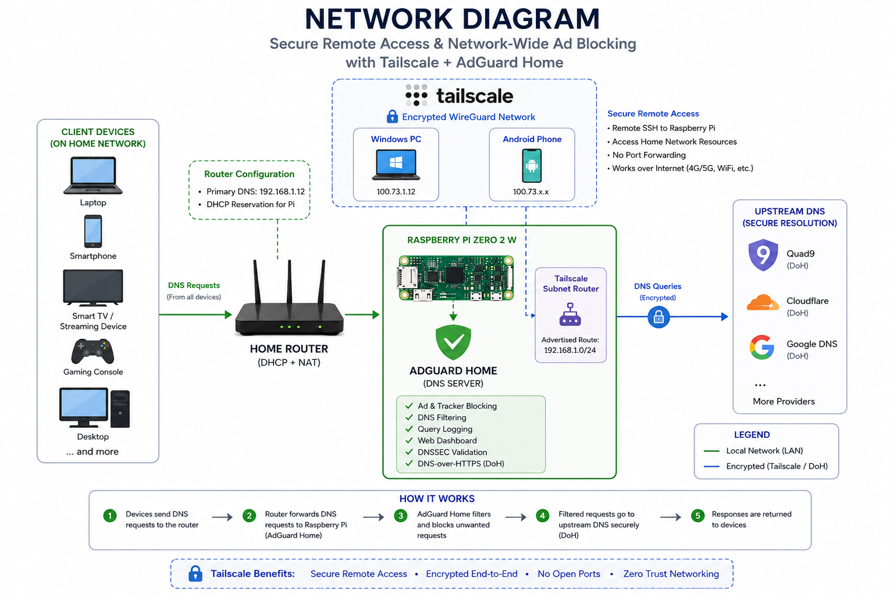
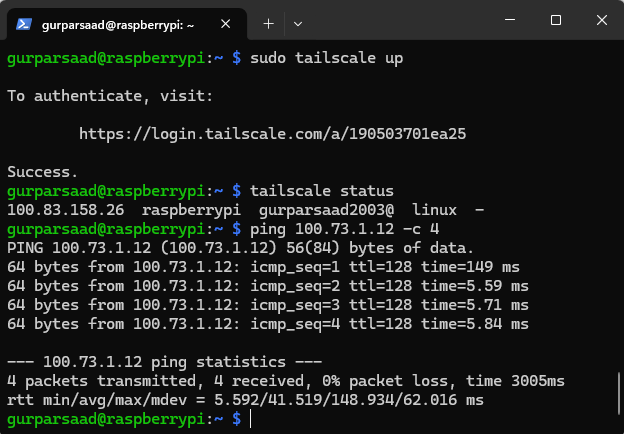
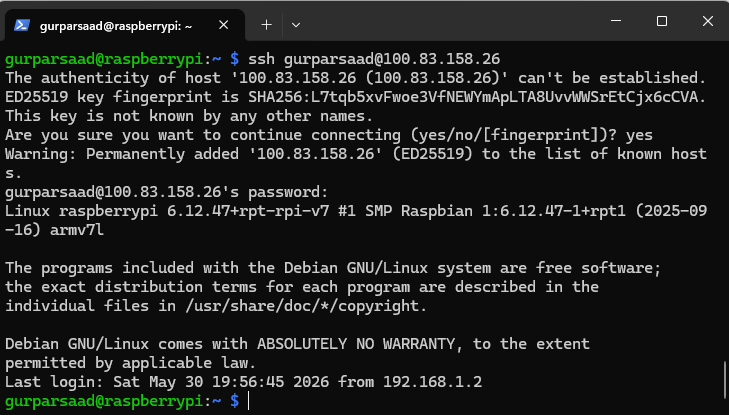
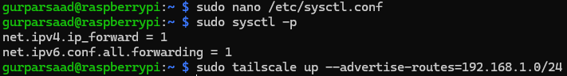
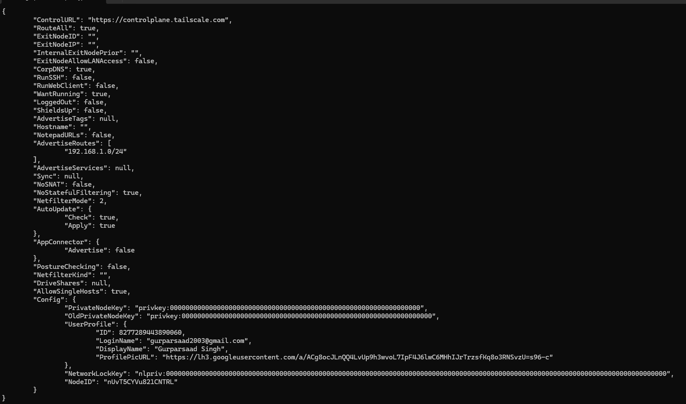
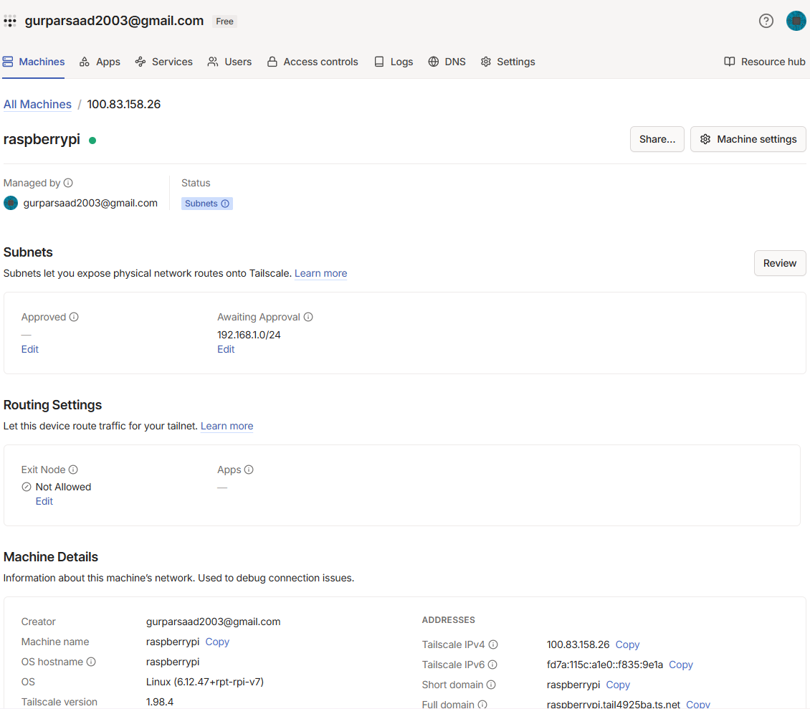
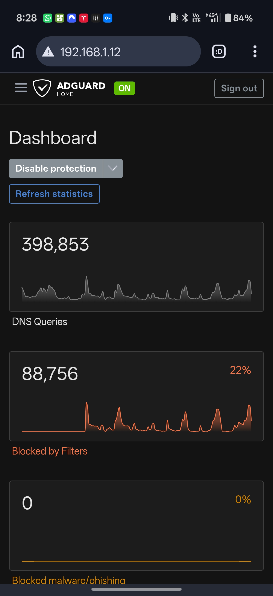

# Raspberry Pi Zero 2 W - Secure Remote Access with Tailscale

## Overview

This project builds on my previous Raspberry Pi Zero 2 W AdGuard Home deployment by adding secure remote access using Tailscale.

The goal was to gain hands-on experience with VPN technologies, WireGuard, secure remote administration, subnet routing, and Zero Trust networking concepts while improving the functionality of my home lab.

Traditionally, remotely accessing devices on a home network requires port forwarding, dynamic DNS, or exposing services to the public internet. Using Tailscale, I was able to securely access my Raspberry Pi and internal network resources from anywhere without opening firewall ports or exposing services publicly.

---

## Project Result



Key outcomes:

* Secure remote access to the Raspberry Pi from anywhere
* Remote SSH management without port forwarding
* Access to AdGuard Home over mobile data
* Raspberry Pi configured as a Tailscale subnet router
* Secure access to devices on the 192.168.1.0/24 network
* WireGuard-based encrypted communication between devices
* Zero Trust style access control using authenticated devices

---

## Architecture



The Raspberry Pi Zero 2 W serves two key functions within the home lab:

1. **AdGuard Home DNS Server** – Provides network-wide ad and tracker blocking while forwarding DNS requests securely using DNS-over-HTTPS.
2. **Tailscale Subnet Router** – Provides secure remote access to internal network resources using encrypted WireGuard tunnels without exposing services to the public internet.

Using Tailscale, authorised devices can securely access the Raspberry Pi and internal home network resources from anywhere while maintaining a Zero Trust security model.

---

## Hardware & Software Used

### Hardware

* Raspberry Pi Zero 2 W
* Home Router
* Windows PC
* Android Phone
* Existing AdGuard Home deployment

### Software

* Raspberry Pi OS Lite
* Tailscale
* WireGuard
* Windows PowerShell
* SSH

---

## Initial Connectivity Setup

Tailscale was installed on the Raspberry Pi:

```bash
curl -fsSL https://tailscale.com/install.sh | sh
```

The device was then authenticated and joined to my Tailnet:

```bash
sudo tailscale up
```

After authentication, both the Raspberry Pi and Windows PC appeared within the Tailscale dashboard.


---

## Connectivity Testing

To verify communication between devices, I performed connectivity testing using ICMP ping.

```bash
tailscale status
ping 100.73.1.12 -c 4
```



The successful responses confirmed encrypted communication between devices through the Tailscale network.

---

## Remote SSH Access

One of the primary objectives was secure remote administration.

Using the Tailscale IP address assigned to the Raspberry Pi, I was able to establish an SSH session without configuring port forwarding on the router.

```bash
ssh gurparsaad@100.83.158.26
```



This allowed secure administration of the Raspberry Pi from any authorised device connected to the Tailnet.

---

## Configuring a Subnet Router

To extend access beyond the Raspberry Pi itself, I configured the device as a Tailscale subnet router.

Initially, Tailscale reported that IP forwarding was disabled:

```text
Warning: IP forwarding is disabled, subnet routing/exit nodes will not work.
```

IP forwarding was enabled within Linux:

```bash
sudo nano /etc/sysctl.conf
```

Configured values:

```text
net.ipv4.ip_forward=1
net.ipv6.conf.all.forwarding=1
```

Changes were applied using:

```bash
sudo sysctl -p
```



This allows the Raspberry Pi to forward packets between the Tailscale network and the local home network.

---

## Advertising Internal Network Routes

The Raspberry Pi was configured to advertise the home network subnet:

```bash
sudo tailscale up --advertise-routes=192.168.1.0/24 --accept-routes
```

Verification:

```bash
tailscale debug prefs
```

Result:

```json
"AdvertiseRoutes": [
  "192.168.1.0/24"
]
```



This allows Tailscale to route traffic destined for the home network through the Raspberry Pi.

---

## Route Approval

The advertised subnet route appeared within the Tailscale administration dashboard awaiting approval.



Subnet advertised:

```text
192.168.1.0/24
```

Once approved, devices connected through Tailscale could securely access internal network resources without requiring Tailscale to be installed on every device.

---

## Remote Access Validation

The final validation test involved disconnecting my phone from home Wi-Fi and connecting via mobile data.

Using Tailscale, I successfully accessed the AdGuard Home dashboard hosted on the Raspberry Pi while connected over 4G.



This demonstrated that:

* Tailscale connectivity was functioning correctly
* Subnet routing was operational
* Internal services were accessible remotely
* No public ports were exposed to the internet
* AdGuard Home could be securely managed from anywhere

---

## Security Improvements

Prior to this project, remote access would have required:

* Port forwarding
* Dynamic DNS
* Exposing services to the public internet

By using Tailscale, remote access is secured through authenticated devices and encrypted WireGuard tunnels.

Benefits of this approach include:

* No exposed public ports
* End-to-end encrypted connections
* Identity-based access control
* Reduced attack surface
* Secure remote administration from anywhere

---

## Key Concepts Explored

### WireGuard

Tailscale uses WireGuard as its underlying VPN protocol.

Benefits include:

* Modern cryptography
* High performance
* Low overhead
* Simple configuration

### Zero Trust Networking

Instead of trusting devices based on network location, access is granted based on authenticated identities and authorised devices.

### Subnet Routing

Subnet routers allow access to devices that do not have Tailscale installed by routing traffic through an authorised gateway device.

### IP Forwarding

IP forwarding enables a device to route traffic between multiple networks. In this project, the Raspberry Pi forwards traffic between the Tailscale network and the home LAN.

---

## What I Learned

This project helped me better understand:

* VPN technologies
* WireGuard
* Zero Trust networking
* Secure remote access
* Linux networking
* IP forwarding
* Network routing
* SSH administration
* Home lab infrastructure
* Identity-based access control

One of the most valuable lessons was understanding how subnet routers can securely bridge private networks without exposing services to the public internet.

---

## Challenges

Some challenges encountered included:

* Understanding how Tailscale differs from traditional VPN services
* Configuring Linux IP forwarding
* Learning subnet routing concepts
* Troubleshooting route advertisement
* Understanding how WireGuard tunnels are established
* Learning how secure remote access can be implemented without port forwarding

Each challenge helped strengthen my understanding of networking fundamentals and secure infrastructure design.

---

## Future Improvements

* Deploy Grafana for infrastructure monitoring
* Monitor Raspberry Pi performance and network usage
* Build a self-hosted WireGuard VPN server
* Implement a network-wide VPN gateway
* Explore VLAN segmentation
* Add centralised logging and alerting
* Expand the home lab with additional services and containers

---

## Final Thoughts

This project expanded my understanding of modern networking and secure remote access technologies.

By combining Tailscale with a Raspberry Pi Zero 2 W, I was able to build a secure, WireGuard-powered remote access solution that provides access to my home network from anywhere while maintaining a strong security posture.

The project also served as a practical introduction to Zero Trust networking, subnet routing, IP forwarding, and infrastructure administration concepts commonly used in modern enterprise environments.

This project forms the second stage of my Raspberry Pi home lab journey, building upon my AdGuard Home deployment and laying the foundation for future projects involving monitoring, VPN technologies, and network infrastructure.
